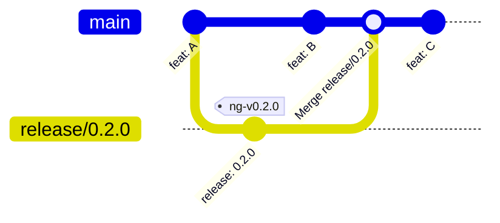

# Contributing

Contributions are welcome! Please follow the guidelines below to help us maintain
a high quality, readable project history.

## Getting Started

1. Fork the repository on GitHub

2. Clone your fork locally:

   ```bash
   git clone https://github.com/<your-username>/ansible-ng.git
   cd ansible-ng
   ```

3. Add the upstream remote so you can keep your fork up to date:

   ```bash
   git remote add upstream https://github.com/opengear/ansible-ng.git
   ```

4. Create a development branch from `main`:

   ```bash
   git checkout -b feature/add-ntp-module
   ```

## Keeping Your Fork Updated

Before starting new work, sync your fork with upstream:

```bash
git fetch upstream
git pull upstream main
```

## Local Installation

To install the collection from the source repository:

```bash
git clone https://github.com/opengear/ansible-ng.git
cd ansible-ng
ansible-galaxy collection install . --force
```

Alternatively, symlink the local source to Ansible collections path:

```bash
git clone https://github.com/opengear/ansible-ng.git
cd ansible-ng

mkdir -p ~/.ansible/collections/ansible_collections/opengear
ln -s /path/to/ansible-ng \
      ~/.ansible/collections/ansible_collections/opengear/ng
```

Development changes will be picked up automatically.

## Configuration

No `ansible.cfg` is provided. A typical development setup for working with
this repo locally:

```ini
[defaults]
collections_path = ~/.ansible/collections
host_key_checking = False
stdout_callback = yaml

[inventory]
enable_plugins = yaml, ini
```

## Pull Requests

If you have a change that you would like to contribute, please follow these guidelines:

- Keep PRs focused; one feature or fix per PR
- Follow [commit quality](#commit-quality) guidelines
- Reference any related issues in the PR description
- Test changes in personal fork before opening an upstream PR
- Ensure Main CI passes before marking the PR as "ready-for-review"
- Integration tests are required to pass before merge
- Add a [changelog fragment](#changelog-fragments) if required

### Commit Quality

We value a clean, readable git history. Please structure your work as a series of
**logical, atomic commits**; each commit should do one thing and one thing only.
Avoid commits like "WIP", "fix", or "misc changes".

Each commit message should follow this structure:

```text
<type>(<optional scope>): <short summary>

<body explaining why change is being made: limit 72 chars per line>
```

This is enforced by `gitlint` (see `.gitlint`) on every commit in a PR: the
summary line must start with one of the types below and stay under 72
characters, and body lines must stay under 72 characters too.

#### Types

| Type       | Description                                                       |
| ---------- | ----------------------------------------------------------------- |
| `feat`     | A new feature or module                                           |
| `fix`      | A bug fix for existing code                                       |
| `docs`     | Documentation changes only                                        |
| `ci`       | Changes to CI workflows                                           |
| `test`     | Adding or updating tests                                          |
| `refactor` | Code change that is neither a fix nor a feature                   |
| `chore`    | Maintenance tasks (gitignore, dependencies, etc.)                 |
| `release`  | Prepare for release (version increment, changelog, release notes) |

#### Example — a well-structured branch

```text
feat(ntp): add ntp module for device configuration

Implements get/set NTP server configuration via the REST API.
Supports multiple NTP servers and authentication.

---

test(ntp): add unit tests for ntp module

Covers server list retrieval, single/multi-server set,
and error handling for unreachable NTP hosts.

---

docs(ntp): add ntp module example playbook

Shows basic NTP configuration for a fleet of devices
using the new opengear.ng.ntp module.
```

Before opening a pull request, review your branch with:

```bash
git log main..HEAD --oneline
```

If you have messy intermediate commits, clean them up with an interactive rebase
before pushing:

```bash
git rebase -i main
```

### Changelog Fragments

If your PR changes behaviour that affects users (new features, bugfix, deprecation),
add a changelog fragment describing it under `changelogs/fragments/` using the format
described in [`changelogs/README.md`](changelogs/README.md) as part of the same PR at
time of contribution.

Fragments are editable on main until release time, so if changes are needed you can
create a new PR.

Purely internal changes (CI, docs, chore, tests, refactors with no behaviour change) do
not need a fragment.

Fragments accumulate on `main` and get rolled into `CHANGELOG.rst` together when the next
[release](#releasing) branch is prepared, so there is nothing else to do once it is merged.
At that point, the fragments are collected and used to generate the release notes, then
removed from source.

## Releasing

Releases are prepared, tested and published from a `release/**` branch, so only the changes
on that branch are released, while allowing development to continue on `main`.



The release steps are:

1. Create the branch from `main`:

   ```bash
   git checkout -b release/0.2.0 main
   ```

2. Increment the `version` in `galaxy.yml`.
3. Optionally add a release_summary fragment giving a short overview of the release under
   `changelogs/fragments/`, as described above.
4. Generate the release notes and commit the result:

   ```bash
   antsibull-changelog release
   git add changelogs/ CHANGELOG.rst
   git commit -m "release: 0.2.0"
   ```

5. Push the branch. The **Release** workflow runs for the release commit:
   - The **Release readiness** job checks that:
     - the version was incremented from where the branch was created, is greater than the latest
       release in its history, and has not already been released,
     - `antsibull-changelog release` has been run and committed with release notes for this version,
     - the release branch does not change `.github`, as workflow changes must already be in main.
   - The **Checks** job ensures lint, sanity and unit tests pass.
   - The **Integration Tests (release)** job ensures tests pass against the test devices.
6. The workflow then builds the collection and waits for approval via the `release` environment.
   - Once approved it publishes to Ansible Galaxy and creates GitHub release tagged `ng-v<version>`
     on the release branch.
   - If the branch has moved since the run started, publishing is refused, cancel it and approve the
     run for the latest commit.
7. Merge the release branch to `main` with a **merge commit**, as shown in the summary of
   the Release run:

   ```bash
   gh pr create --base main --head release/0.2.0 --title "release: 0.2.0" --fill
   ```

   Do not squash or rebase, so the tagged commit stays in the history of `main`.

   Once merged, the release branch can be deleted.

8. If a patch release is required, create a new release branch from the release tag. For example,
   `git checkout -b release/0.2.1 ng-v0.2.0`.
